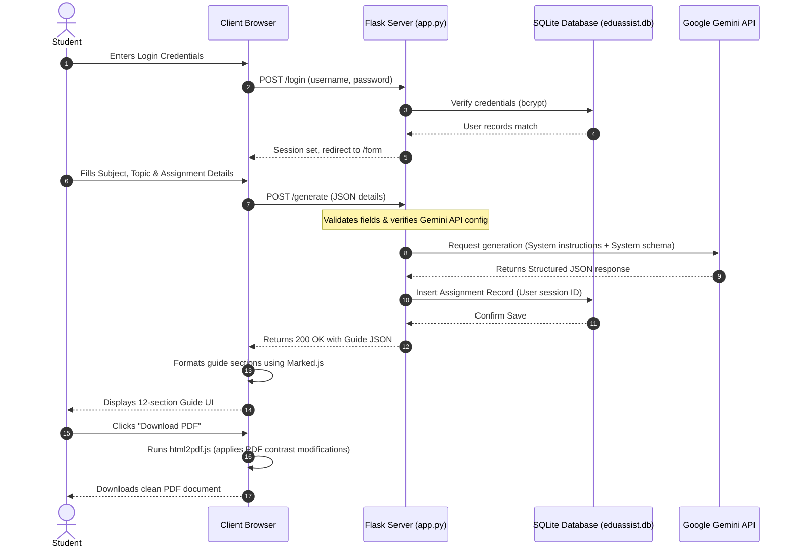

# EduAssist AI - Assignment Helper Agent

EduAssist AI is a high-performance, responsive, and production-ready AI-powered web application designed to act as an intelligent college teaching assistant and learning companion for students. Unlike standard AI tools that supply flat answers directly, EduAssist AI prioritizes concept comprehension first—structuring guides to teach students the "why" behind topics before showing the solution. This fosters active learning, preparing students for exams, viva-voce assessments, and job interviews.

---

## 📖 Table of Contents
1. [Problem Statement & Use Case](#problem-statement--use-case)
2. [Workflow & Architecture](#workflow--architecture)
3. [Technology Stack](#technology-stack)
4. [Database Architecture](#database-architecture)
5. [Directory Structure](#directory-structure)
6. [Installation & Configuration](#installation--configuration)
7. [Running the Project](#running-the-project)
8. [Backend Endpoints Catalog](#backend-endpoints-catalog)
9. [Detailed UI & Styling Highlights](#detailed-ui--styling-highlights)
10. [Technical Resolutions (PDF & Contrast Fixes)](#technical-resolutions-pdf--contrast-fixes)
11. [Verification & Testing](#verification--testing)
12. [License](#license)

---

## 💡 Problem Statement & Use Case

### The Problem
When solving assignments, students often rely on copy-pasting answers from search engines or basic AI text generators. While this completes the homework, it leaves them unprepared for academic exams, oral viva-voce evaluations, and technical interviews. There is a critical lack of guided, concept-first learning.

### The Solution: EduAssist AI Agent
The **Assignment Helper Agent** guides students through their homework by producing detailed structured outputs. Instead of simple text generation, the agent enforces a rigid 12-section study guide using a strict JSON schema with the Google Gemini API (`gemini-2.5-flash`):

1. **Concept Explanation**: Explains the core theory in clear, student-friendly terms with bold markers.
2. **Learning Objectives**: 5-7 actionable and measurable learning outcomes (e.g., "Understand", "Apply").
3. **Step-by-Step Explanation**: A breakdown showing the logical progression of solving the question.
4. **Simple Example**: A beginner-friendly worked example or real-world analogy.
5. **Assignment Solution**: A comprehensive, academic-ready solution format for submission.
6. **Code Example**: Clean, commented, runnable code (supporting C, C++, Java, Python) or marked N/A.
7. **Complexity Analysis**: Time and space complexities (Big-O notation) with reasonings.
8. **Important Key Points**: 6-8 critical concepts to memorize for examinations.
9. **Viva Questions**: 5 likely oral test questions paired with concise, accurate responses.
10. **Practice Questions**: 4 similar exercises of varying difficulties (left unanswered for self-study).
11. **Interview Prep**: 3 interview questions with detailed explanations.
12. **Short Summary**: A 150-200 word summary containing quick revision notes and a single-line takeaway.

---

## 🔄 Workflow & Architecture

The application implements a secure multi-page workflow managed by Python/Flask on the backend and HTML5/Bootstrap 5/Vanilla JS on the frontend:



### Complete Steps:
1. **User Authentication**: The user registers and logs in. Password hashing is secured using `bcrypt`.
2. **Details Input**: Once authenticated, the student inputs details via a styled form page (`/form`) select-input and textarea (featuring validation controls and a character counter).
3. **Prompt Compilation & API Invocation**: The backend constructs a structured instruction request and feeds it into the Gemini Generative Model configured with strict schema properties (`ASSIGNMENT_SCHEMA`) and customized system directives (`SYSTEM_INSTRUCTION`).
4. **Data Persistence**: The response payload is converted back to JSON, linked to the user's account, and persisted inside the SQLite database (`eduassist.db`).
5. **Interactive UI Rendering**: The client-side application decodes the JSON payload, dynamically renders it in markdown cards using `Marked.js`, and sets up quick-tab headers, copy commands, and visual layout settings.
6. **Utility Integrations**: The user can copy specific sections, the entire text, or export the document as a styled PDF using client-side libraries.

---

## 🛠️ Technology Stack

* **Frontend Layout**: HTML5, Vanilla JavaScript, CSS3 (Advanced custom glassmorphism and custom scroll transitions).
* **UI Components**: Bootstrap 5.3.3 & Bootstrap Icons.
* **Backend Framework**: Python 3.8+ & Flask (WSGI compliant).
* **Database Layer**: SQLite & Flask-SQLAlchemy.
* **AI Model Engine**: Google Gemini API via `google-generativeai` SDK (running `gemini-2.5-flash`).
* **Frontend Rendering Utilities**:
  * **Marked.js** (v12.0.0 CDN) - Parses markdown responses into readable HTML.
  * **html2pdf.js** (v0.10.1 CDN) - Converts HTML elements into vector PDFs client-side.
* **Hashing & Security**: Flask-Bcrypt (blowfish encryption).

---

## 🗄️ Database Architecture

The SQLite schema consists of two tables linked via a one-to-many relationship:

```text
  +------------------+             +---------------------+
  |      users       |             |     assignments     |
  +------------------+             +---------------------+
  | id (PK)          |<-----------+| id (PK)             |
  | username (UNIQUE)|             | user_id (FK)        |
  | email (UNIQUE)   |             | subject             |
  | password_hash    |             | topic               |
  | created_at       |             | question            |
  +------------------+             | guide_json          |
                                   | created_at          |
                                   +---------------------+
```

### SQLAlchemy Models (app.py)
* **`User` Model**:
  * Represents registered users. Holds username, email, and password hashes.
  * Extends cascading deletes to all associated assignments (`cascade='all, delete-orphan'`).
* **`Assignment` Model**:
  * Represents learning guides generated by students.
  * Keeps the subject, topic, core question, and serialized JSON guide block returned by Gemini.

---

## 📂 Directory Structure

```text
Assignment-Helper-Agent/
│
├── app.py                  # Flask main entrypoint (routes, DB models, Gemini initialization)
├── requirements.txt        # Backend dependencies & libraries
├── eduassist.db            # SQLite database file (created on initial launch)
├── .env                    # Local environment config (ports, environments, Gemini keys)
│
├── templates/              # HTML layout documents
│   ├── login.html          # Authentication login screen
│   ├── register.html       # Authentication registration screen
│   ├── form.html           # Target details submission input
│   ├── guide.html          # Dynamic 12-section learning guide workspace
│   └── history.html        # Interactive user dashboard displaying saved assignments
│
├── static/                 # Static styling & client logic assets
│   ├── style.css           # Curated CSS styling with light/dark variable schemes
│   └── script.js           # Interactive triggers, theme toggling, form checking, PDF printing
│
├── test_app.py             # Unit testing validation suite
├── user_prompts.txt        # Consolidated project prompts log
└── README.md               # Extensive project documentation
```

---

## ⚙️ Installation & Configuration

### Prerequisites
* **Python 3.8** or higher.
* A valid **Google Gemini API Key** (obtainable from [Google AI Studio](https://aistudio.google.com/)).

### Steps

1. **Clone or Download the Project**:
   Ensure you locate files inside the project folder.

2. **Open Terminal / Command Line** in the root directory:
   ```bash
   cd Assignment-Helper-Agent
   ```

3. **Set Up Python Virtual Environment**:
   ```bash
   # Windows PowerShell / CMD
   python -m venv venv
   .\venv\Scripts\activate

   # Linux / macOS
   python3 -m venv venv
   source venv/bin/activate
   ```

4. **Install Dependencies**:
   ```bash
   pip install -r requirements.txt
   ```

5. **Configure Environment Variables**:
   Create a `.env` file in the root folder (or edit the existing one) with these entries:
   ```env
   # Google Gemini API key
   GEMINI_API_KEY=your_gemini_api_key_here

   # Flask deployment configs
   FLASK_ENV=development
   PORT=5000
   SECRET_KEY=eduassist-secret-98765-xyz
   ```

---

## 🚀 Running the Project

### Running Flask App Locally

Execute the launch command:
```bash
python app.py
```
Upon running:
* SQLite creates tables inside `eduassist.db` automatically if they don't exist.
* The logging system confirms initialization (`🚀 EduAssist AI starting on http://0.0.0.0:5000`).

Open your browser and navigate to:
**[http://localhost:5000](http://localhost:5000)**

### Default Login Accounts
You can register an account directly on the UI or use this pre-configured developer profile (if loaded):
* **Username**: `Kumar`
* **Password**: `Kumar1234`

### ☁️ Deploying to Render

This application is pre-configured for automated deployment to **Render** using the provided `render.yaml` Blueprint.

#### Option A: Blueprint Deployment (Recommended)
1. Commit and push your repository to GitHub.
2. In the [Render Dashboard](https://dashboard.render.com/), click **New** -> **Blueprint**.
3. Select and connect your repository.
4. Render will parse `render.yaml` and provision:
   - A free-tier **PostgreSQL Database** resource.
   - A **Python Web Service** mapped to run `gunicorn app:app`.
   - The database credentials, automatically linked via `DATABASE_URL`.
5. Enter your **`GEMINI_API_KEY`** value when prompted in the configuration setup.

#### Option B: Manual Setup
If you prefer to configure resources manually:
1. Create a new **Web Service** on Render and connect your GitHub repo.
2. Set configuration properties:
   - **Environment**: `Python`
   - **Build Command**: `pip install -r requirements.txt`
   - **Start Command**: `gunicorn app:app`
3. Add the following **Environment Variables**:
   - `GEMINI_API_KEY`: *(your Gemini API key)*
   - `FLASK_ENV`: `production`
   - `SECRET_KEY`: *(a random secure key string)*

---

## 🛣️ Backend Endpoints Catalog

| Endpoint | Method | Authentication | Description |
|---|---|---|---|
| `/` | `GET` | None | Redirects to `/form` if logged in, otherwise `/login`. |
| `/register` | `GET`, `POST` | None | Registers a new user. Performs email validation and username unique checking. |
| `/login` | `GET`, `POST` | None | Processes logins, checks Bcrypt passwords, sets session identifiers. |
| `/form` | `GET` | Required | Renders assignment request form screen. |
| `/guide` | `GET` | Required | Renders answer space where guide content is loaded. |
| `/history` | `GET` | Required | Retrieves the dashboard containing the list of past guides generated by the user. |
| `/history/<id>` | `GET` | Required | Serves a single saved assignment guide payload as JSON. |
| `/history/<id>` | `DELETE` | Required | Removes a saved guide record from the database. |
| `/logout` | `GET` | None | Destroys current session logs and redirects back to `/login`. |
| `/generate` | `POST` | Required | Sends input parameters to Gemini and returns structured guide output. |
| `/health` | `GET` | None | Returns system health statuses, active Gemini configuration presence, and model tags. |

---

## 🎨 Detailed UI & Styling Highlights

EduAssist AI features a rich, responsive dashboard styled with curated CSS variables and dynamic components:
* **Background Particle Generator**: Generates floaty background vector bubbles on page initialization (`initParticles()` in `script.js`).
* **Glassmorphism Theme**: Translucent cards utilizing blurred backdrops (`backdrop-filter: blur(16px)`), styled gradients, and subtle border shadows.
* **Dual Theme Toggle (Dark & Light)**: Supports instant light/dark switches, modifying contrast dynamically.
* **Responsive Masonry Grid Layout**: The guide features a grid displaying shorter sections side-by-side and long blocks (Concept, Solution, Summary) in full width.

---

## 🛠️ Technical Resolutions (PDF & Contrast Fixes)

During development, major styling and rendering bugs were identified and successfully resolved:

### 1. Form Field Typing Visibility
* **Issue**: In dark mode, typing inside input text fields and textareas was barely visible due to insufficient font contrast against input backgrounds.
* **Resolution**: Tweaked text input selector CSS, assigning solid high-contrast values to text color attributes while active (`color: var(--text-primary)`) and using high-contrast borders (`border-color: rgba(99,102,241,0.5)`).

### 2. Empty PDF Generation
* **Issue**: Using `html2pdf.js` directly caused exported documents to render as blank sheets with no readable characters.
* **Resolution**: The template wrapper `.guide-workspace` used custom CSS properties and variables that canvas renderers could not resolve in background threads. Introduced a specific temporary class (`.pdf-exporting`) in JS during printing to force readable layouts and colors before PDF execution, reverting it immediately after saving.

### 3. Missing Contrast in PDF Text
* **Issue**: Dark mode background colors persisted on elements during print execution, causing text to appear faint or unreadable.
* **Resolution**: Added CSS rules targeting media outputs (`@media print`) and `.pdf-exporting` context scopes to force clean backgrounds and black text for optimal readability:
  ```css
  .pdf-exporting, .pdf-exporting * {
      background: #ffffff !important;
      color: #000000 !important;
      box-shadow: none !important;
  }
  ```

### 4. Mid-line Page Clipping in PDF Output
* **Issue**: Multi-page PDF exports clipped sentences in half vertically across pages.
* **Resolution**: Set the layout script to map page breaks gracefully:
  ```javascript
  pagebreak: { mode: ['avoid-all', 'css', 'legacy'] }
  ```
  Added custom CSS block constraints to enforce breaks before structural elements:
  ```css
  .section-card {
      page-break-inside: avoid;
      break-inside: avoid;
  }
  ```

---

## 🧪 Verification & Testing

Verify installation integrity and routes using Python's native `unittest` framework:

```bash
python -m unittest test_app.py
```

### Validations Performed:
* App routes initialization tests.
* Form requests payload structure compliance (correctly yields `400 Bad Request` if mandatory inputs are omitted).
* Endpoint validation when Gemini configuration credentials are not found (`500 Server Error`).

---

## 📄 License

This project is open-source and licensed under the **MIT License**.
